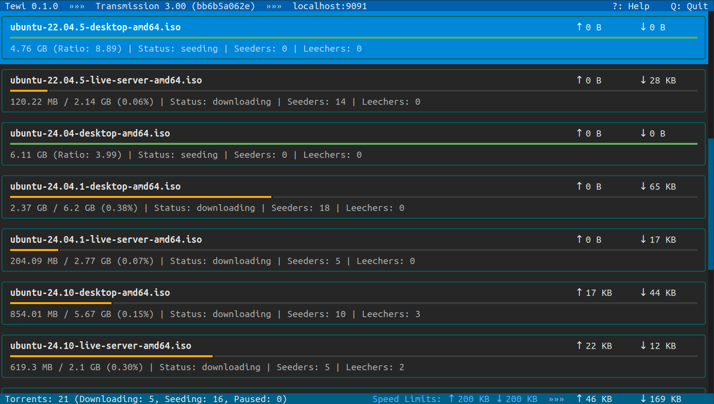

<div align="center">
  <h1 align="center">Tewi</h3>

  <p align="center">
    Text-based interface for the Transmission BitTorrent daemon
  </p>
</div>

## About



Tewi is a TUI (text user interface) interface for the Transmission BitTorrent daemon.

### Built With

* [Python 3](https://www.python.org/)
* [Textual](https://textual.textualize.io/)
* [transmission-rpc](https://github.com/Trim21/transmission-rpc)

## Getting Started

### Prerequisites

Tewi requires Python 3.10+.

### Installation

Recommended way to install is to use `pipx` or `pip`:

```
$ pipx install tewi-transmission
```

## Usage

Launch Tewi from command line:

```
$ tewi
```

By default it connects to Transmission daemon on http://localhost:9091. To change these settings
you could specify your connection details:

```
$ tewi --host XXXX --port XXXX
```

Check other command line options using help command:

```
$ tewi --help
```

View available hot-keys in Tewi by pressing `?` key.

## Contributing

Feel free to open bug reports and send pull requests.

## License

Distributed under the GPL3+ license. See `LICENSE.txt` for more information.

